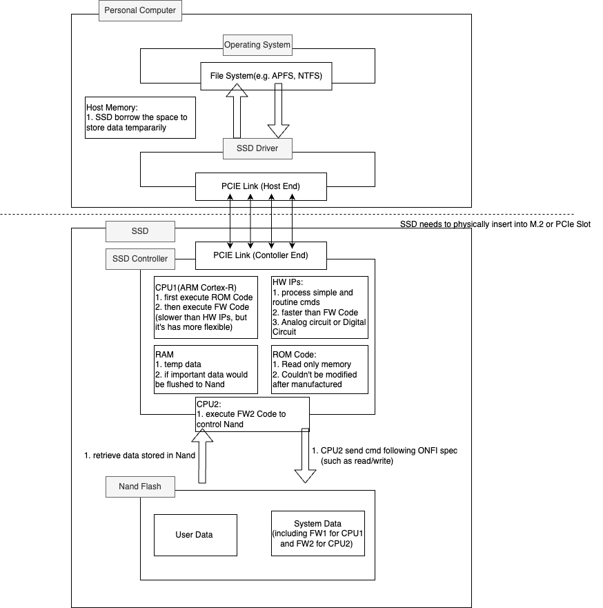
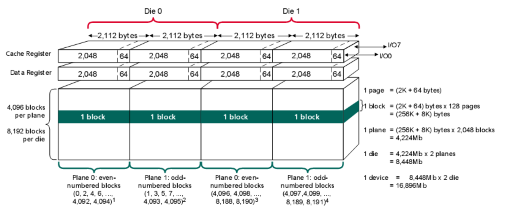

# Solid-State Drive (SSD) Conceptual Notes
# 1. Overview
- SSD Architecture:

# 2. SSD Controller
- Role: control the NAND Flash in order to meet the commands from host
- Architecture
    - CPU1(ARM Cortex-R)
    - CPU2
    - Normal FW
    - ROM Code
    - HW IPs
    - RAM
# 2.1 CPU1(ARM Cortex-R)
- Role:
    - process the code of Normal FW and ROM Code
    <!-- - send commands to other HW IPs, and received results from othe HW IPs
    - be a control center to manage the resources -->
- Key Point
    - work with ARM designated IDE to compile FW(.c/.h) to execution code(.bin). ARM compiler, ARM assember, ARM Linker are included in this IDE
    - Use Makefile script to construct the build code process
    - 32 Bits processor
    - MPU: Memory protection unit. The region needs to be protected could be assigned in StartUp.s (e.g., Stack Area)
    - AXI: 
- Memory
    - Scatter file: design how the memory area is distributed by user
    - ATCM: a memory region to place execution code
    - BTCM: a memory region to store global data
    
- Register
    - system coprocessor(CP15): used to. how to control CP15 in FW
    - CPSR
    - SPSR
    - General core Register
    - PC
    - LR
    - SP 

# 2.2 CPU2
- Role: 
    - Share the overhead of CPU1(ARM Cortex-R)
    - Level is lower than CPU1(ARM Cortex-R). The host for CPU2 is CPU1; the host for CPU1(ARM Cortex-R) is Personal Computer / Server
    - Send the low-level commnand to NAND Flash
- Key Point
    - CPU1(ARM Cortex-R) only needs to send top-level commnads (the effort to build these commands is low) to CPU2 which would reorganize these commands into low-level commands which NAND Flash could understand
    - Not only transfering into low-level commands, CPU2 could optimize different independent commands to the related efficient instructions in order to acheive die-interleaving, plane-interleaving or cache operation to increase the throughput

- Interation for 2 CPUs
    - Each CPU must have their well-define reponsibilities (e.g., CPU1: service real Host(PC/Server) commands, and manage HW IPs resources; CPU2: directly control NAND Flash)
    - Allocate a memory as an area to communicate with each other. It should be careful to read/write this region, or it may occur unexpected behavior. (e.g., read the old data, overwrite the new data). Hence, it needs the lock/mutex to protect that memory while one CPU is manupulating this area.

# 2.3 ROM Code
- Role: 
    - The very first code to execute while power on (prior to Normal FW)
    - Check the authentication of Normal FW. 
    - Load the authenticated Normal FW to ATCM where CPU1 execute the instructions
- Key Point
    - ROM Code stored in ROM (Read Only Memory), the data won't disappear after power off
    - After fully verification, ROM Code would be sent to semiconductor fab and be programmed into ROM
    - ROM Code could not be modified after manufactured 
    - Although ROM Code cannot be updated, its behavior could be affected by Efuse (Permanent physical change)

# 2.4 HW IP
- Role: 
    - Share the overhead of CPU1
    - Execute the simple and routine requests from Normal FW in an extremely high speed
- Key Point: 
    - Include digital HW IP and analog HW IP
    - Execution speed of HW IP (measured in ns) is significantly faster than that of normal FW (measured in us).
    - Once controller is manufactured, HW IP cannot be updated

- Type of HW IP (just take some examples):
    - Arramge RAM for Normal FW
    - Encypted and decrypted IP
    - Copy data (it's faster than CPU's memcpy())  
    - Table management (record where user data stored in NAND Flash)
    - Build the PCIe Link with Host
    - Mailbox to connect Normal FW and other HW IP

- How does Normal FW communicate with HW IP?
    - Normal FW inserts a request into the corresponding HW IP's queue. The HW IP then pops the request and executes it
    - After sending the request, the FW continues executing other tasks. Once the HW IP completes the request, it notifies the FW to retrieve the results.
    - This asynchronous interaction mode significantly boosts controller performance.

# 2.5 RAM
- Role:
    - Place the temporary data
    - Memory belongs to controller not CPU
    - Different from memory in CPU1. These RAM is peripheral memory in the perspective of CPU1
- Key Point:
    - RAM is a limited resourse and must be allocate carefully
    - Since RAM is a volatile memory that cannot permanently store data, the data must be transferred to NAND Flash for long-term storage. 

- Points of caution
    - Be careful of the issue of data coherency (data on RAM is different from that in NAND Flash)
    - Be careful to use the same RAM area by different IP (overwrite the data unexpectedly)

# 3. NAND Flash
- Role:
    - Store the data permenantly
    - Load the data from NAND Flash to RAM after power cycle
    - Follow the ONFI specification
- How to store data?
    - Injecting electrons into the cell puts it into a programmed state, which is defined as "0".
    - Removing electrons from the cell puts it into a erased state, which is defined as "1".
- Potential issue:
    - As time passes, electrons stored in the cell may leak, which can lead to data inaccuracies (e.g., a cell programmed to a "0" state initially holds 100 electrons. If electron leakage over an extended period reduces this count to 50, the cell's value could be mistakenly read as a "1")
- Solutions
    - Applying the appropriate read level to read the cell data. (e.g., A cell is read as "0" if its electron count is greater than 70. To prevent data misinterpretation due to electron leakage, this threshold can be adjusted, for example, by reading the cell as "0" if the count is greater than 40)
    - Copy the data from the old location to a new location. This allows the original location to be erased and reprogrammed with new data.

- Architecture
    
- Support Basic Cmd
    - Read / Write / Erase / Set&Get feature / Reset
    - the unit to issue a command is die

- How to optimize the I/O performance?
    - Issue the die-interleaving commands:
        - After a command is issued to Die0, the next command can be issued to Die1 without waiting for the first operation to finish
    - Issue the plane-interleaving commands:
        - If two planes within the same die need to be read, a multi-plane read is more efficient than a basic read because it significantly shortens the busy time of the operation
    - Issue the cache commands:
        - To optimize read operations within the same die, the controller can issue a new command to load data from NAND flash into the Data Register. This happens in parallel with the ongoing transfer of the first data set from the Data Register to the Cache Register

# 4. Host
- Role: 
    - The top-level commander to issue command to SSD
    - Follow PCIe and NVMe Spec to communicate with SSD
- Architecture
    - File System(part of Operating System): 
        - SSD is mangaed in the domain of file system 
        - While the user operates the applications related to file system, it would trigger commnands to operate SSD
    - Driver
        - Receiving commands from file system, send commands directly to SSD
        - A driver is essential for allowing an operating system to recognize an SSD and access its data.
        - In the perspective of SSD, the host of SSD is driver