# Debug Case Studies
# 1. Unexpected Variable Underflow
- Fail Scene: 
    1. The firmware encountered a stall within the FTL flow.

- Debug Step: 
    1. Since the failure scenario was difficult to reproduce, I reviewed the firmware event logs, which record historical variable states and firmware behavior.

    2. After pinpointing the suspected line, I analyzed its corresponding assembly code to understand the root cause.

- Root Cause
    1. There was a condition intended to check whether the variable returned to a specific value. However, the expression was not precise enough to handle the scenario correctly.

    2. In the following example, (Num - 1) evaluates to 0xFFFF_FFFF instead of 0xFF when U8 Num = 0. As a result, unexpected behavior occurs if Num is zero.
       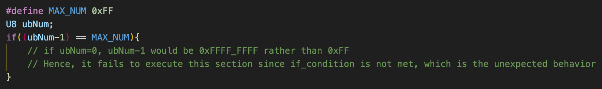

    3. After analyzing the assembly code corresponding to the above expression, it became evident that it could lead to unexpected behavior.

    4. The firmware developer cannot predict the exact behavior of the assembly code, as it is generated by the compiler.

- Solution:
    1. Write the C code explicitly to prevent any potential misinterpretation by the compiler.

    2. Modify that expression in a more explicit way. 
        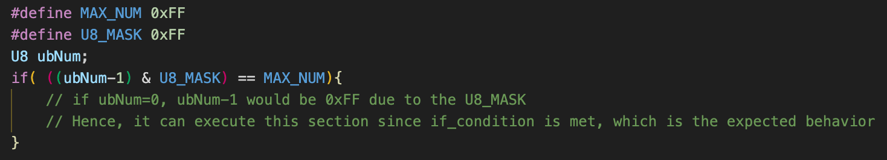

# 2. Unexpected Performance Speed Drop
- Fail Scene: 
    1. The SSD experienced a 100 MB/s drop in read/write performance.

- Debug Step:
    1. After including a commit modified for the low power mode scenario, the SSD’s read/write performance decreased by 100 MB/s. However, during the R/W speed test, the firmware was expected not to be in low power mode, so the performance should not have been affected by this change.

    2. To investigate, the assembly code of the version with the change was compared to that of the version without the change.

- Root Cause:
    1. According to the assembly code analysis, applying the change for low power mode affected how the function’s arguments were stored.

    2. In the following example, it shows the original version which all arguments could be placed in ARM Core register:
        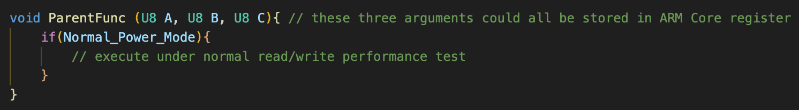

    3. The low power mode modification affected how ParentFunction() stores its arguments. In the earlier version, all arguments (U8 A, U8 B, U8 C) were stored in ARM core registers. After the change, some arguments were moved to the stack because the number of variables exceeded the available core registers. The explanation is shown as below:
        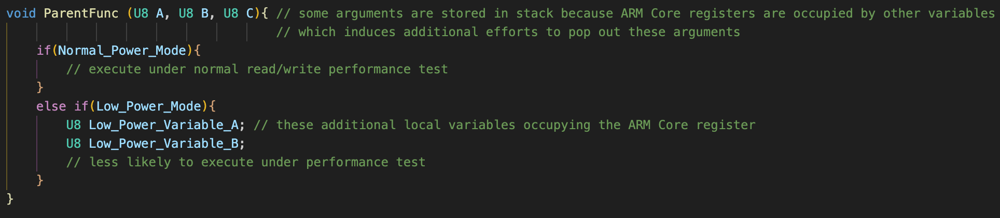

    4. As a result, each execution of ParentFunction() required popping arguments from the stack, introducing additional overhead and causing a drop in execution speed. 

    5. If a function contains too many local variables or arguments, it is unlikely that all of them can be stored in the ARM core registers.
       
- Solution: 
    1. To optimize register usage on ARM, remove unused local variables and function arguments. This ensures that essential data can reside in core registers, improving performance.
        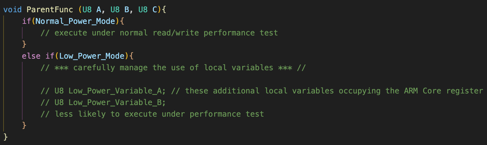

    2. Since the low power mode case is infrequently executed, the Unlikely ARM instruction can be used to hint the compiler not to optimize this branch.
        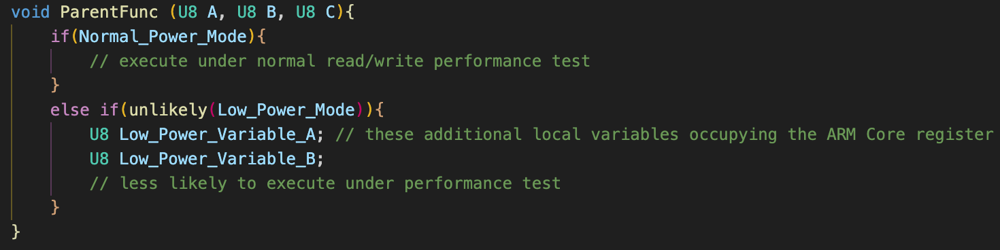

# 3. Data Misalignment of D-Cache and RAM
- Fail Scene:
    1. The table wasn't saved to NAND Flash properly.
- Debug Step:
    1. Add the debug info to check if table was handle correctly.

    2. Inspect the attribute of the table's memory address.

- Root Cause:
    1. To accelerate execution speed, CPU only updated the table in D-Cache without flushing it to system buffer (peripheral memory). Accessing data in D-Cache allows the CPU to operate with extremely low latency.

    2. However, when using the HW_API to program data into NAND Flash, it only references the system buffer. From the HW_API’s perspective, the data stored exclusively in D-Cache is invisible.
    
    3. The root cause is illustrated as below:  
        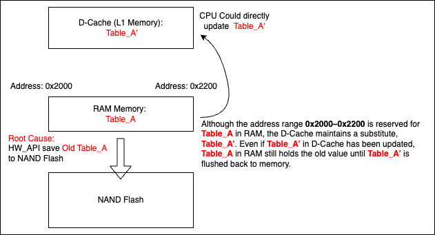

- Solution: 
    1. Once the table's value is finalized, the data must be flushed from D-Cache to system buffer. This ensures HW_API can access the correct data in system buffer.  
        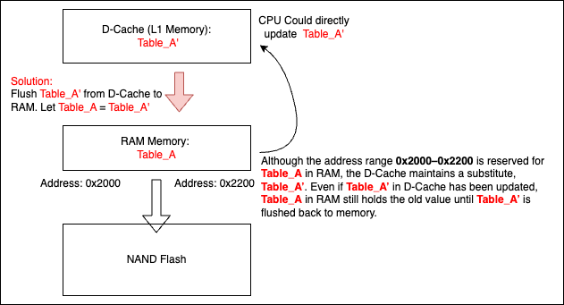

# 4. Data Misalignment Caused by Timing Issues between FW and HW
- Fail Scene:
    1. After power on, one table is loaded from NAND Flash. However, this table appeared to be incorrect.

- Debug Step:
    1. Resolving this issue requires a thorough understanding of the table’s lifecycle, including monitoring runtime modifications and determining when the variable is saved or loaded.

    3. However, it's appeared that the table is saved by HW_API and the version of variable is unexpected.
   
- Root Cause:
    1. The Table* A is programmed by HW_API, but it doesn't guarantee that HW has finished programming Table* A into NAND Flash after FW executing ProgramFlash_HW_API(A).
        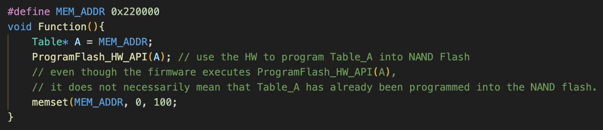

    2. Hence, if the value on MEM_ADDR(where Table* A located) was modified before it's completely programmed, the value save into NAND Flash would be unexpected. 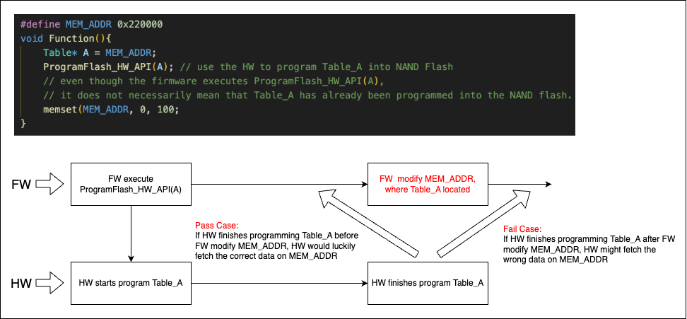

- Solution: 
    1. Add the barrier to ensure HW finished programming.
        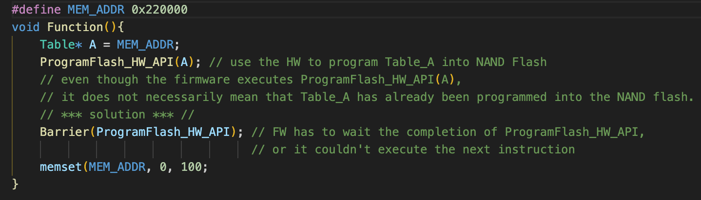

    2. Copy Table* A to another memory address MEM_ADDR_BACKUP where will not be modified in that function.
        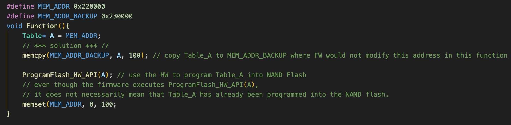

   
# 5. CPU Abort Caused by unexpectedly Overwritting Stack Area
- Fail Scene: 
    1. An unexpected CPU abort occurred during the execution of normal code.

- Debug Step:
    1. Set the breakpoint before the line where CPU abort happened.
    
    2. Use the JTAG debugger to single-step through execution and identify the failure point.

- Root Cause:
    1. An array was declared in the parent function and passed as an argument to the child function.

    2. Within the child function, more elements were written to the array than its original size defined in the parent function.

    3. The excessive elements overwrote data stored on the stack. If the overwritten data is no longer used, this may not immediately cause an issue. However, in this case, the excessive elements overwrote the return address, preventing the program counter from retrieving the correct return value.

    4. The root cause is illustrated as below:
        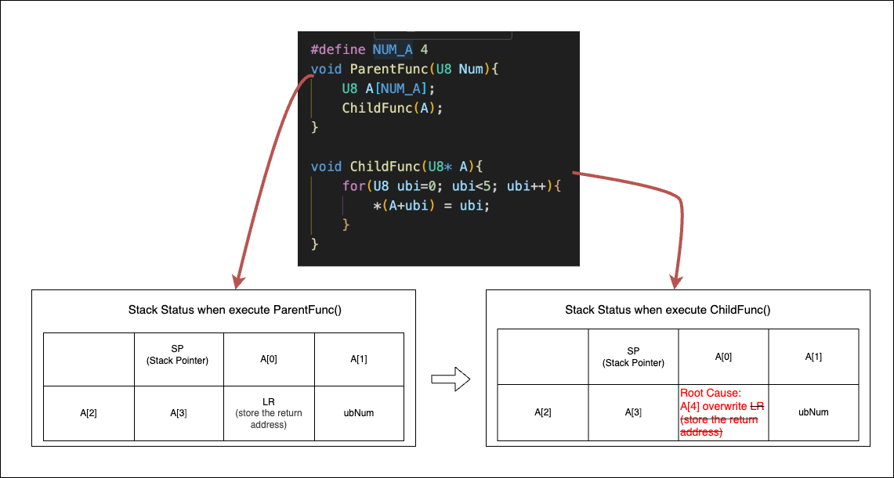

- Solution: 
    1. Be cautious when using pointers, and verify that they do not overwrite other data on the stack.

    2. If a pointer must be used, include an assert statement to validate its state and prevent unexpected runtime behavior. The assert is shown as below: 
     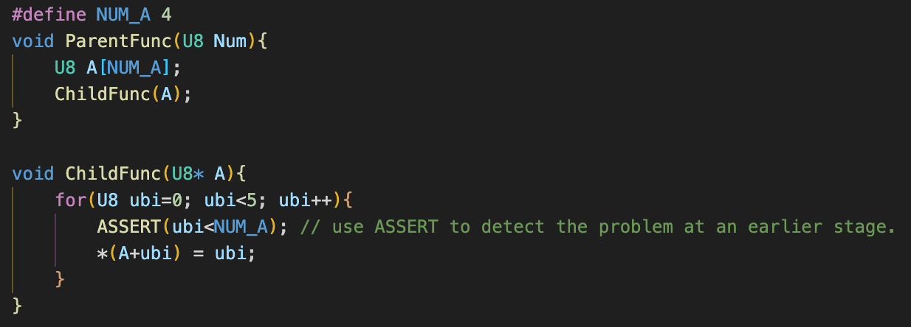

# 6. Clock Uncoherency
- Fail Scene: 
    1. After flashing the first version of the firmware to the SSD controller, the second version could not be flashed successfully.
        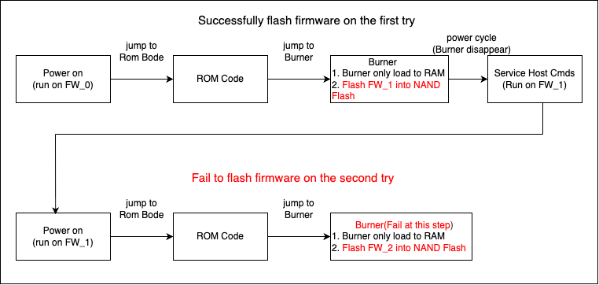
- Debug Step:
    1. Since the hang occurred before the UART hardware was initialized, no debug information could be printed to clarify the failure.
    
    2. The .axf file was loaded onto the target CPU to begin debugging from main() using a JTAG debugger.

    3. Once the CPU was set to the first line of main(), single-stepping was employed to locate the failure point.

- Root Cause:
    1. The failure point occurred at the first commands sent directly from the controller to the NAND Flash in the stage of Burner of second try.

    2. The controller clock was not synchronized with the NAND Flash clock, causing the commands to be misinterpreted.
    3. The root cause is illustrated as below: 
        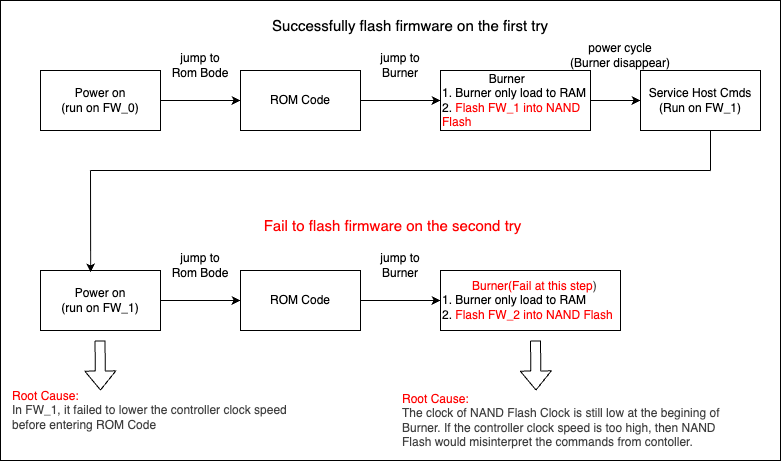
- Solution: 
    1. Confirm that the clock speeds of both the controller and the NAND Flash are correctly configured.
    2. Lower the controller's clock speed before entering ROM Code.
        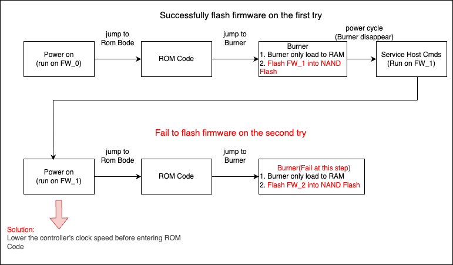

# 7. Problematic ARM Scatter File
- Fail Scene: 
    1. The firmware became stuck in the FW update flow because the size of the input FW.bin was unexpected.
- Debug Step:
    1. Investigated the build code flow to identify where the input FW.bin was generated.

- Root Cause:
    1. The ARM scatter file defines how memory is allocated to specific regions, such as ATCM and BTCM.
        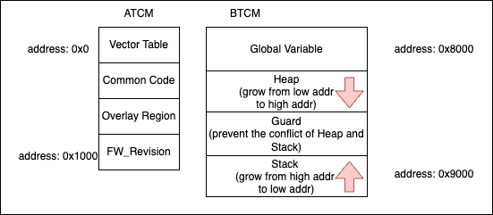
    2. An incorrect modification to the scatter file caused the ATCM size to be set incorrectly. As a result, the firmware update flow intercepts such invalid firmware to prevent it from being flashed to the controller.

- Solution: 
    1. Fix the ARM scatter file