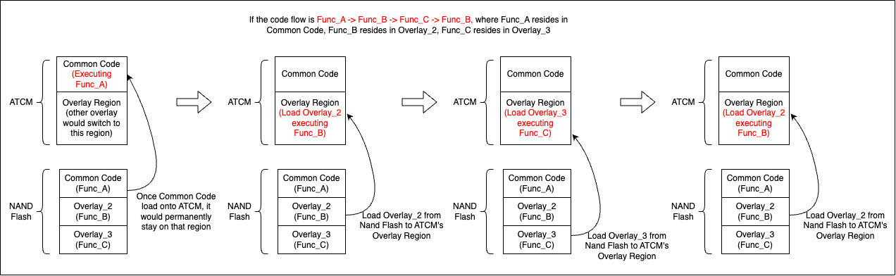

# Optimization Case
# 1. Optimize the efficiency of flashing firmware
- Original Version
    1. When flashing the firmware, all physical blocks in NAND Flash must be erased to reset the data storage state. Physical blocks are the basic unit to erase in NAND Flash. In this version, the controller issues the erase command to one specific block at a time and does not issue the next erase command until the previous block has been fully erased. If there are four channels, there will be four corresponding busy latencies. The illustration is as follows:
    
    2. Since only one physical block is erased at a time, handling error messages is straightforward if NAND Flash fails to erase a block.
- Request
    1. To improve production line efficiency, the firmware flashing time should be minimized.
- Refined Version
    1. In the SSD architecture, each channel operates independently, allowing them to process commands in parallel.
    2. By issuing erase commands to all channels simultaneously, NAND Flash only incurs a single erase latency, after which all targeted blocks across channels are erased together. The illustration is as follows:
    
    3. The error message contains the erase results of blocks across all channels. If an error occurs, the firmware must analyze the report to identify which block failed to erase. Once the failed block is pinpointed, the firmware can continue with the appropriate error-handling procedure.
    4. By shortening the total latency required to erase blocks across channels, the overall time spent flashing new firmware is reduced. This optimization improves firmware update efficiency and, in turn, increases productivity on the production line.

# 2. Shorten the latency of firmware update
- Original Version
    1. The host can issue NVMe commands, such as Firmware Download and Firmware Commit, to update the SSD firmware after it has been flashed on the production line. To execute the new firmware, the device must pass through the ROM Code, which loads the updated firmware into the ATCM. During a firmware update, the CPU clock speed used in ROM Code execution is the same as that used for a normal power cycle. The flow of Firmware Update could be divided into following subsections:  
    
    2. Both firmware updates and normal power cycles go through the ROM Code. However, their behaviors differ slightly. In the case of a firmware update, it is permissible to raise the CPU clock speed during ROM Code execution, which can help shorten the overall firmware update latency. 

- Request
    1. In order to meet customer requirements, the total firmware update latency must be reduced.

- Refined Version 
    1. Divide the process into multiple subsections and measure the latency of each.
    2. Identify that ROM code execution latency is longer compared to other subsections.
    3. Increase the CPU clock speed during ROM code execution.
    
# 3. Optimize the placement of ARM Overlay to enhance the FW execution efficiency 
- Original Version
    1. When the CPU executes firmware code, the code must reside in the ATCM region, which includes both the common code region and the overlay region. The code in the common region remains static, while the overlay region is dynamically updated by loading code segments from NAND Flash. This continuous loading induces overhead, which can hinder overall performance. If the placement of ARM Overlay could be optimized, it could improve the performance.   
    Take the following figure as example. Since Func_C resides in Overlay_3, firmware has to spend additional efforts to load Overlay_3 from NAND Flash to ATCM after executing Overlay_2's Func_B.
    

- Request: 
    1. In order to enhance the Read/Write performance, the frequency of overlay switching should be reduced.

- Refined Version
    1. According to the ARM compilation results, the overlay to which each function belongs is known.
    2. Take the above case as an example. Placing Func_C in Overlay_2 eliminates the need for the firmware to load Overlay_3 into ATCM, which saves extra effort. The illustration is shown as following:
    
    3. To optimize read/write execution speed, I first identify the most frequently used function and its corresponding hierarchical calling path. My goal is to optimize the placement of functions within the overlay along the target calling path. 
    4. The calling path of the function could be expressed as a tree structure as following. The optimization scenario could be classified as two cases:
    
        1. Case_1 (Target on the specific function): Func_E(red circle) is a very low-level function, and it is preferred to be placed in ATCM’s Common Code. As long as the low-level function is placed in the Common Code, the firmware does not need to switch the Overlay Region regardless of which Overlay was last used, since the Common Code always resides in ATCM. 
        2. Case_2 (Target on the frequently used call path): The path of Func_G →  Func_H →  Func_E (purple circle) is both called by Func_F and Func_I. Since this path is frequently invoked, it takes higher priority in optimizing the ATCM placement of these three functions. After optimizing the path Func_G → Func_H → Func_E, the next step is to optimize the path of Func_F with (Func_G → Func_H → Func_E) and Func_I with (Func_G → Func_H → Func_E). 
    